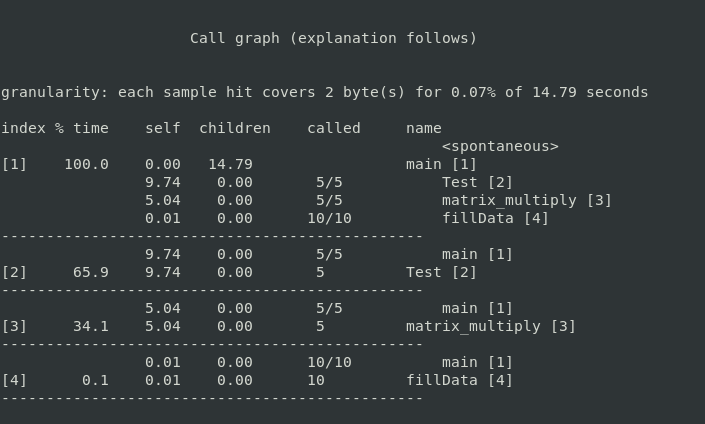

# Assignment 1 - Optimizations

## Getting started

### gprof

#### What it does

gprof is a GNU profiler. It produces an execution profile of C, Pascal, or Fortran77 programs. The effect of called routines is incorporated in the profile of each caller. The profile data is taken from the call graph profile file.

#### Introduction to profiling

Profiling allows you to learn where your program spent its time and which functions called which other functions while it was executing. 

This information can show you which pieces of your program are *slower than you expected*, and might be candidates for rewriting to make your program execute faster. It can also tell you which *functions are being called more or less* often than you expected. This may help you *spot bugs* that had otherwise been unnoticed.

#### How it works

Gprof calculates the amount of time spent in each routine. Next, these times are propagated along the edges of the call graph. Cycles are discovered, and calls into a cycle are made to share the time of the cycle.

Several forms of output are available from the analysis.

The flat profile shows how much time your program spent in each function, and how many times that function was called. If you simply want to know which functions burn most of the cycles, it is stated concisely here :P 

The call graph shows, for each function, which functions called it, which other functions it called, and how many times. There is also an estimate of how much time was spent in the subroutines of each function. This can suggest places where you might try to eliminate function calls that use a lot of time.

The annotated source listing is a copy of the program’s source code, labeled with the number of times each line of the program was executed.

#### pg flag 

From the man-page of gcc

*"Generates extra code to write profile information suitable for the analysis program gprof. You must use this option when compiling the source files you want data about, and you must also use it when linking."*

TLDR :P  : Enable profiling during compilation 

### Download and install 

Run the command 
```bash
apt-get install binutils
```
#### Usage 
```gprof options [executable-file [profile-data-files…]] [> outfile]```

Example: 
Suppose your code is in TestGprof.c
```bash
gcc -pg -o TestGprof TestGprof.c
./TestGprof
gprof -b TestGprof gmon.out > analysis.out
```
This will give an human readable file. 
This file contains two tables: 

1. **flat profile**: overview of the timing information of the functions 
2. **call graph**: focuses on each function

`-b` option will suppress lot of verbose information which would be otherwise included in analysis file.

#### Running gprof on our programs

<div align ="center">    

<p> Flat profile for Matrix Multiplication </p> 
<br> 

<p> Call graph for Matrix Multiplication </p> 

<p> Flat profile for Merge Sort </p> 
<br> 

<p> Call graph for Merge Sort </p> 
</div>

### perf

#### What it does

gprof produces an execution profile of C, Pascal, or Fortran77 programs. The effect of called routines is incorporated in the profile of each caller. The profile data is taken from the call graph profile file.

#### How it works

Performance counters are CPU hardware registers that count hardware events such as instructions executed, cache-misses suffered, or branches mispredicted. perf provides rich generalized abstractions over hardware specific capabilities. Among others, it provides per task, per CPU and per-workload counters, sampling on top of these and source code event annotation.

Tracepoints are instrumentation points placed at logical locations in code, such as for system calls, TCP/IP events, file system operations, etc. perf dynamically creates tracepoints using the kprobes and uprobes frameworks, for kernel, userspace dynamic tracing. perf can also collect information including timestamps and stack traces  

#### Usage

perf stat [\<options>][\<command>] [ARGS]

### Running perf on our executables
<div align ="center">    

<p> perf for Matrix Multiplication </p> 
<br> 

<p> perf for Merge Sort</p>
</div>

### Cachegrind: *a cache and branch-prediction profiler*

#### What it does

Cachegrind is a tool for doing cache simulations and annotating your source line-by-line with the number of cache misses. In particular, it records:

- L1 instruction cache reads and misses;
- L1 data cache reads and read misses, writes and write misses;
- L2 unified cache reads and read misses, writes and writes misses.


One instruction cache read is performed per instruction executed, you can find out how many instructions are executed per line, which can be useful for *traditional profiling* and *test coverage*.

#### Usage

`valgrind --tool = cachegrind ./mm`

#### Running cachegrind on our codes

<div align ="center">    

<p> Cachegrind for Matrix Multiplication </p> 
<br> 

<p> Cachegrind for Merge Sort </p> 
</div>

### clock_gettime()

#### Usage

```c
# include<time.h>
int clock_gettime(clockid_t clk_id, struct timespec *tp);
```

#### What it does
The functions clock_gettime() retrieves the time of the specified clock clk_id. 

#### How it works

- The function fills in a structure containing two fields: a seconds and nanoseconds count of the time since the Epoch (00:00 1 January, 1970 UTC). 

- We must include the *time.h* header file to use this function.

- The **structure** (pun unintended) of `struct timespec` is as follows:

```c
struct timespec {
        time_t   tv_sec;        /* seconds */
        long     tv_nsec;       /* nanoseconds */
};
```
- The second parameter *clk_id* is the identifier of the particular clock on which to act. A clock may be system-wide and hence visible for all processes, or per-process if it measures time only within a single process.

    There are multitude of clocks and we can specify which one to use:
    - CLOCK_REALTIME
    - CLOCK_MONOTONIC
    - CLOCK_PROCESS_CPUTIME_ID
    - CLOCK_THREAD_CPUTIME_ID

#### How we used it

This function can be used to measure the runtime of our programs.
For measuring elapsed time, **CLOCK_MONOTONIC** is recommended. So our code looks as follows:
```c
    clock_gettime(CLOCK_MONOTONIC, &start);
    //function call here
    clock_gettime(CLOCK_MONOTONIC, &end);
```
<div align ="center">    

<p> Run time for Matrix Multiplication </p> 
<br> 

<p> Run time for Merge Sort</p>
</div>

#### Fun facts!

It is a successor to *gettimeoftheday* system call but with *higher precision* and the ability to request *specific clocks*. 

## Matrix Multiplication

This report has been written to analyze Matrix Multiplication and to document the attempts made to optimize its runtime and the reasoning behind the optimizations. 


We use matrices of size p * q and  q * r with MAXSIZE being 1000 * 1000. The numbers are randomly generated. This report contains *both successful and unsucessful optimizations*.

The optimizations have been done in a series of steps and their best runtimes (out of 5 runs) have also been documented.

### Version 1

Standard matrix multiplication with no optimizations gave a run time of __

```c
for (i = 0; i < p; i++)	
{
    for (j = 0; j < r; j++) 
    {
        for (k = 0; k < q; k++) 
            result->matrix[i][j] += (a->matrix[i][k] * b->matrix[k][j]);
    }
}
```
Run time is 5.913352s

### Version 2

```c
for (i = 0; i < p; i++)	
{
    for (k = 0; k < q; k++) 
    {
        for (j = 0; j < r; j++) 
            result->matrix[i][j] += (a->matrix[i][k] * b->matrix[k][j]);
    }
}
```

Loop reordering - using i, k, j instead of i, j, k gave a significant increase in speed making the run time lesser.

This happens because matrix B has *poor spatial locality* for cache in the case of i, j, k.

The order i, k, j gives good spatial locality for the resultant matrix, good temporal locality for matrix A (accesses same element until j loop is completed), and good spatial locality for matrix B. 

This can be viewed in the figures below:

 | 

Run time is 2.723198s

### Version 3

Taking transpose of the matrix and then multiplying. This gives spatial locality for both A and B.

Optimizing the transpose:

```c

int max = q ^ ((q ^ r) & -(q < r));
for(int i = 0; i < max; i++)
{
    for(int j = 0; j < i; j++)
    {
        b->matrix[i][j] =  b->matrix[i][j] ^ b->matrix[j][i];
        b->matrix[j][i] =  b->matrix[i][j] ^ b->matrix[j][i];
        b->matrix[i][j] =  b->matrix[i][j] ^ b->matrix[j][i];

    }
}
```

This uses XOR operations to swap elements instead of using a temporary variable and second loop runs till j < i and so does not traverse every element of the matrix.

max value between q and r is also found using bitwise operations and does not use comparison operator making it faster.

Run time is 2.601342s

### Version 4

Temporary variables:

Using temporary variables instead of writing to memory gave a significant speed up as the runtime became.
This occurs because instead of accessing memory every time, we just change a local variable, and change the value in memory at the end.

```c
for (i = 0; i < p; i++)	
{
    for (j = 0; j < r; j++) 
    {
        int c = 0;
        for (k = 0; k < q; k ++) 
            c += a->matrix[i][k] * b->matrix[j][k] 
        result->matrix[i][j] = c;
    }
}
```
Runtime: 1.501735s

### Version 5

Loop Unrolling 

```c
 for (i = 0; i < p; i++)	
    {
        for (j = 0; j < r; j++) 
        {
            int c = 0;
			for (k = 0; k < q - 4; k += 4) 
                c += a->matrix[i][k] * b->matrix[j][k] + a->matrix[i][k+1] * b->matrix[j][k+1] + a->matrix[i][k+2] * b->matrix[j][k+2] + a->matrix[i][k+3] * b->matrix[j][k+3];
            
            while(k < q)
                c += (a->matrix[i][k] * b->matrix[j][k++]);

            result->matrix[i][j] = c;
		}
	}
```

Experimenting with the loop unrolling order gave that unrolling k to **16** gave us the best run time.

Runtime: 1.197106s

### Version 6

Blocking: 

We experimented with blocking but the run time increased. This may be because blocking works well only for parallelization with `cilk_for` which we are not allowed to use. Hence, we did not include it in our final code.

Runtime: 1.217699s

### Version 7

Using 1D arrays and accessing with pointer reference:

```c
for (i = 0; i < p; i++)	
{
    int *aa = a->matrix[i];
    for (j = 0; j < r; j++) 
    {
        int *bb = b->matrix[j];
        int temp = 0;
        for (k = 0; k < q - 16; k += 16) 
            temp += (*(aa + k)) * (*( bb + k)) + (*(aa + k+1)) * (*( bb + k+1)) + (*(aa + k+2)) * (*( bb + k+2)) + 
            (*(aa + k+3)) * (*( bb + k+3)) .. 
    
    }
}
```

Random experimentation with the code led us to discover that referencing by pointer gave a better run time than accessing matrix[i][j].

Runtime: 1.205617s

### Version 8

Added merge sort in assembly. Inspiration taken from CSO course of sem 2.
Runtime: 1.017699s

Assembly code runs faster than C code as it directly operates on the registers and instructions take fewer clock cycles. 
Assembler cannot generate as optimized a .s code as humans do as we use fewer registers and instructions. 

### Final Results 

 


## Merge Sort

This report has been written to analyze the MergeSort algorithm and to document the attempts made to optimize its runtime and the reasoning behind the optimizations. The array used to test the algorithm is of integer type and has 10^6 elements  

The optimizations have been done in a series of steps and their best runtimes (out of 5 runs) have also been documented along with their suspected causes

### Version 1

This is the regular recursive MergeSort which has does O(nlogn) operations

Approx Runtime = 0.265005s

### Version 2

Here we replace the Recursive Merge Sort with Iterative.

Approx Runtime = 0.261194s

Reason: Reduction in overhead of recursion due to lesser function calls in the iterative version which implies lesser context switches.

### Version 3

All the functions are merged into a single function

Approx Runtime = 0.250398s

Reason: Reduction in overhead due to lesser function calls which implies lesser context switches.

### Version 4

MergeSort is replaced with Insertion Sort at the lowest level of the mergesort, i.e, The array is first sorted in blocks of fixed size using Insertion Sort. Merge Sort is then applied to the new array formed.

By experimenting, we found optimal block size to be **16**.

```c
for (i = 0; i < n; i += block) 
{	
    int left = i;
    int right = ((i+block-1) < (n-1)) ? (i+block-1) : (n-1);
    for (int x = left + 1; x <= right; x++) 
    { 
        int temp = *(arr + x); 
        int y = x - 1; 
        while (arr[y] > temp && y >= left) 
        { 
            arr[y+1] = arr[y]; 
            y--; 
        } 
        arr[y+1] = temp; 
    } 
}
```

Approx Runtime = 0.186910s

Reason: For smaller arrays, the cost of overhead outweighs the other benifits of MergeSort(O nlogn) over slower algorithms like Insertionsort(O n^2).
Also, insertion sort is an inplace sort, hence time isnt wasted in transferring elements of the array to and from temporary arrays. Hence Insertion Sort is preferred for smaller arrays (of size 16 for out program).

### Version 5

Making the code more compact
eg:- The following code

```c
arr[k] = arr[i];
k++;	 i++;
```

can be written as:
```
arr[k++] = arr[i++]
```

Approx Runtime =  0.185427s

Reason: Because of more compact code, more instructions can be fit into the instruction cache

### Version 6

Replace multiplictaions with powers of 2 with binary left shift operator.

Approx Runtime: 0.145997s

Reason: Multiplictaion takes more cycles than bitwise shift opteration.

Eg. curr_size * 2 -> curr_size << 1
```c
for (curr_size = block; curr_size <= n-1; curr_size = curr_size << 1)  
{ 
    for (left_start = 0; left_start < n-1; left_start += curr_size << 1) 
    { 			
        int x = left_start + curr_size - 1, y = left_start + curr_size << 1 - 1, z = n -1;
        ...
    }
}
```

### Version 7

We tried replacing currsize << 1 by a temporary variable everywhere so as to reduce computations but that only increased run time. 
This may be due to the declaration of a new, unnecessary variable as the operation was just being used twice.

### Version 8

Reduce recalculation of variables

```c
for (left_start = 0; left_start < n-1; left_start += curr_size << 1) 
{ 
    mid = ((left_start + curr_size - 1) < (n-1)) ? (left_start + curr_size - 1) : (n-1);
    right_end = ((left_start + (curr_size << 1) - 1) < (n-1)) ? (left_start + (curr_size << 1) - 1) : (n-1);
}
```

was changed to 

```c
int x = left_start + curr_size - 1, y = left_start + curr_size << 1 - 1, z = n -1;
int mid = (x < z)? x: z;
int right_end = (y < z)? y: z;
```
Approx Runtime: 0.148010s

Reason: Instead of calculating each of x, y, and z again. We just stored them in variables - this reduces number of computations and reduces run time unlike Version 7 since a lot of operations are taking place here. 

### Version 9

Loop Unrolling

Approx Runtime: 0.144812s

Reason: Loop unrolling saves work by combining consecutive iterations of a loop into fewer iterations, thereby reducing the number of times the instructions that control the loop must be executed. 

```c
	for (i = 0; i < n1; i++) 
		L[i] = arr[left_start + i]; 
```
was changed to

```c
for (i = 0; i < n1 - 8; i+=8) 
{

    L[i] = arr[left_start + i]; 
    L[i+1] = arr[left_start + i +1];
    L[i+2] = arr[left_start + i + 2];
    L[i+3] = arr[left_start + i + 3]; 
    L[i+4] = arr[left_start + i + 4]; 
    L[i+5] = arr[left_start + i + 5]; 
    L[i+6] = arr[left_start + i + 6]; 
    L[i+7] = arr[left_start + i + 7]; 	

}
```
In the above Example, the packed loop has n comparisons while the unpacked loop has n/8 comparisons.

Experimentation gave us the value 8 as the optimum unrolling size.

### Version 10

Using inbilt function `memcpy` which copies the elements of one array into another taking size as an input.

```c
    memcpy (L, &arr[left_start], sizeof(n1*sizeof(int)));
    memcpy (R, &arr[mid+1], sizeof(n2*sizeof(int)));
```

This copies blocks of memory from one location to another and reduces run time.

Runtime: 1.039514

### Final Results 
 
## To Note

We used the inbuilt sort and standard matrix multiplication code to verify these answers so all the results are valid and run times are not arbitrary.